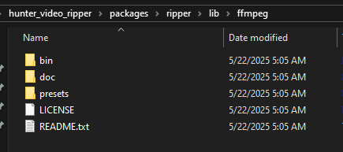

# Hunter Learning Video Rips

## Installation Instructions (1 time install)

### Install App Code
All of these are run from a command prompt in the project folder
```
npm install -g yarn
```
```
yarn
```
```
yarn workspace @hunterlearning/video-rip-frontend build
```

### Install Video libs
Download the FFMPEG library (ffmpeg-git-essentials.7z) from [the codex](https://www.gyan.dev/ffmpeg/builds/).

It'll be a `7z` file. If you don't have [7zip](https://www.7-zip.org/) install it.

Unzip the download into the `packages/ripper/lib/ffmpeg` folder in this codebase. (You may need to create the folder.) It should look like this:


### Running the App
Create a text file on your desktop named `ripper.bat`.
Edit the file to contain the following:
(if you installed the project to your c: drive)
```
cd folder/you/installed/the/app/to
yarn start:server
```

You can then start the server by running the `.bat` file from your desktop.

When the terminal that comes up states
```
app listening on port 4000
```
Leave this terminal open, and open [http://localhost:4000](http://localhost:4000) in any browser and have at it.